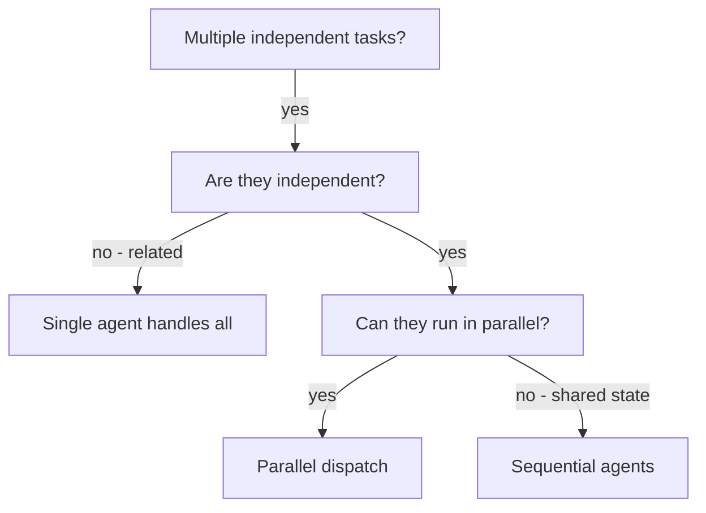

# Dispatching Parallel Agents

## Overview

When you have multiple independent tasks — different failing tests, separate research questions, unrelated features, distinct subsystems — handling them sequentially wastes time. Each task can be delegated to a focused agent working in isolation.

**Core principle:** Dispatch one agent per independent problem domain. Let them work concurrently.

**Key insight:** Agents work with isolated context. They never inherit your session's history — you construct exactly what they need. This keeps each agent focused on its task and preserves your own context for coordination work.

## When to Use



**Use when:**
- 2+ test files failing with different root causes
- Multiple subsystems need investigation independently
- Parallel research across different sources or topics
- Independent features that don't share state
- Each task can be understood without context from the others

**Don't use when:**
- Tasks are related (completing one reveals what the next needs)
- Need to understand the full system state before acting
- Agents would edit the same files or shared resources
- Exploratory debugging where you don't know what's broken yet

## The Pattern

### 1. Identify Independent Domains

Group tasks by what they involve and confirm they don't share state:
- Task A: Tool approval flow tests
- Task B: Batch completion behavior
- Task C: Abort functionality

Verify: fixing A doesn't affect B or C. If unsure, investigate one first.

### 2. Craft Focused, Self-Contained Agent Prompts

Each agent prompt must include everything the agent needs — it has no access to your session's context. Include:
- **Specific scope:** One test file, subsystem, or question
- **Clear goal:** What does success look like?
- **Relevant context:** Error messages, file contents, background
- **Constraints:** What should the agent avoid touching?
- **Expected output:** What should the agent return?

### 3. Dispatch in Parallel

```typescript
// All three run concurrently — don't await between them
Task("Fix agent-tool-abort.test.ts failures")
Task("Fix batch-completion-behavior.test.ts failures")
Task("Fix tool-approval-race-conditions.test.ts failures")
```

For research tasks, the same applies:
```typescript
Task("Research rate limiting patterns in REST APIs")
Task("Research websocket reconnection strategies")
Task("Research OAuth2 PKCE flow implementation")
```

### 4. Review and Integrate

When agents return:
- Read each summary
- Verify fixes don't conflict with each other
- Run the full test suite or integration check
- Combine the results

## Writing Good Agent Prompts

The quality of the prompt determines whether the agent succeeds. Because agents start with isolated context, you are responsible for giving them exactly what they need.

**Debugging example:**
```markdown
Fix the 3 failing tests in src/agents/agent-tool-abort.test.ts:

1. "should abort tool with partial output capture" - expects 'interrupted at' in message
2. "should handle mixed completed and aborted tools" - fast tool aborted instead of completed
3. "should properly track pendingToolCount" - expects 3 results but gets 0

These are likely timing/race condition issues. Your task:
1. Read the test file and understand what each test verifies
2. Identify root cause — timing issues or actual bugs?
3. Fix by replacing arbitrary timeouts with event-based waiting,
   or fixing bugs in the abort implementation
4. Do NOT just increase timeouts — find the real issue
5. Do NOT change production code outside this domain

Return: Summary of root cause and what you changed.
```

**Research example:**
```markdown
Research best practices for handling WebSocket reconnection in browser clients.

Focus on:
- Exponential backoff with jitter
- Maximum retry limits
- Detecting intentional vs. unintentional disconnects
- Common pitfalls (memory leaks, event listener accumulation)

Return: A concise summary of patterns with pros/cons for each.
```

## Common Mistakes

| Problem | Bad | Good |
|---|---|---|
| Scope too broad | "Fix all the tests" | "Fix agent-tool-abort.test.ts" |
| Missing context | "Fix the race condition" | Include error messages and test names |
| No constraints | (none given) | "Do NOT change production code" |
| Vague output | "Fix it" | "Return summary of root cause and changes" |
| Assuming context | (no background) | Include relevant code snippets or file contents |

## When NOT to Dispatch in Parallel

- **Related failures:** Fix one might fix others — investigate sequentially first
- **Unknown breakage:** You don't know what's broken yet — explore first, then parallelize
- **Shared state:** Agents would interfere (editing same files, consuming same resources)
- **Dependent tasks:** Task B needs the output of Task A to know what to do

## Verification After Agents Return

1. **Review each summary** — understand what each agent changed and why
2. **Check for conflicts** — did any agents edit the same code?
3. **Run the full suite** — verify all fixes work together
4. **Spot check** — agents can make systematic errors; sample a few outputs

## Example: Debugging Session

**Scenario:** 6 test failures across 3 files after a major refactoring

| File | Failures | Root cause domain |
|---|---|---|
| `agent-tool-abort.test.ts` | 3 | Timing/race conditions |
| `batch-completion-behavior.test.ts` | 2 | Event structure bug |
| `tool-approval-race-conditions.test.ts` | 1 | Async execution timing |

**Decision:** Three independent domains — abort logic is separate from batch completion, which is separate from race conditions.

**Dispatch:** Three agents in parallel, each scoped to one file.

**Results:**
- Agent 1: Replaced arbitrary timeouts with event-based waiting
- Agent 2: Fixed event structure bug (threadId in wrong location)
- Agent 3: Added wait for async tool execution to complete

**Integration:** All fixes independent, no conflicts, full suite green.

## Key Benefits

1. **Speed** — N problems solved in the time of 1
2. **Focus** — Each agent has narrow scope and less context to track
3. **Independence** — Agents don't interfere with each other
4. **Context preservation** — Your coordination context stays clean while agents work
