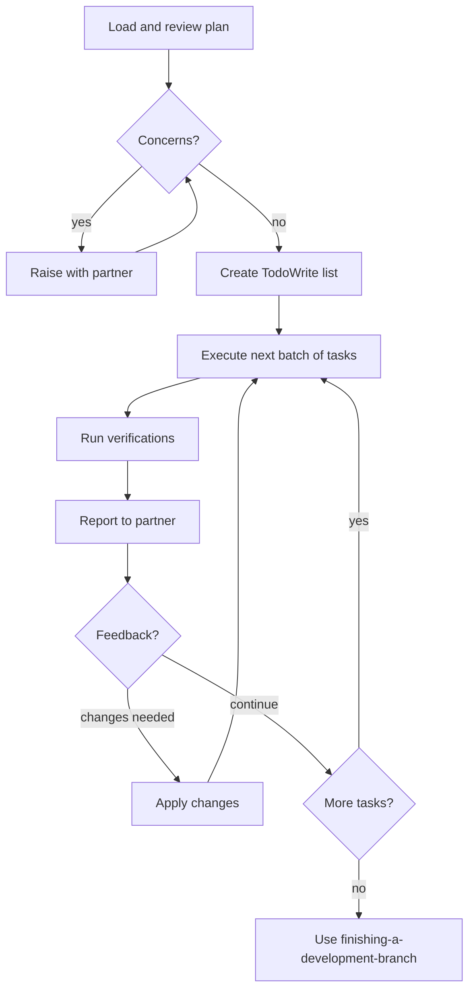

# Executing Plans

## Overview

Load plan, review critically, execute tasks in batches, report for review between batches.

**Core principle:** Batch execution with checkpoints for architect review — you implement, then pause for human eyes before continuing.

**Announce at start:** "I'm using the executing-plans skill to implement this plan."

**Note:** This skill is designed for parallel sessions (no subagents). If you're in a session *with* subagents available, `subagent-driven-development` will give better results — fresh context per task and automated review gates. But if you're here, you're in the right place.



## The Process

### Step 1: Load and Review Plan

1. Read plan file
2. Review critically — identify any questions or concerns about the plan
3. If concerns: Raise them with your human partner before starting
4. If no concerns: Create TodoWrite with all tasks and proceed

### Step 2: Execute Batch

**Default: First 3 tasks** (adjust based on complexity — 1 for risky/complex tasks, up to 5 for simple/mechanical ones)

If the plan already has chunk markers (`## Chunk N: ...`), use those as your batches.

For each task in the batch:
1. Mark as `in_progress`
2. Follow each step exactly — the plan has bite-sized steps for a reason
3. Run verifications as specified in the plan
4. Mark as `completed`

### Step 3: Report and Wait

When the batch is complete, report clearly:

```
Batch complete:
- Task N: [what was done, verification output]
- Task N+1: [what was done, verification output]

Ready for feedback.
```

Wait. Don't start the next batch until the partner responds.

Apply any changes from feedback, then execute the next batch.

### Step 4: Complete Development

After all tasks complete and verified:
- Announce: "I'm using the finishing-a-development-branch skill to complete this work."
- **REQUIRED SUB-SKILL:** Use `superpowers:finishing-a-development-branch`
- Follow that skill to verify tests, present options, execute choice

## When to Stop and Ask for Help

**STOP executing immediately when:**
- Hit a blocker mid-batch (missing dependency, test fails, instruction unclear)
- Plan has critical gaps preventing starting
- You don't understand an instruction
- Verification fails repeatedly (don't retry the same failing approach)

**Ask for clarification rather than guessing.** The human wrote the plan — they know the intent.

## When to Revisit Earlier Steps

**Return to Review (Step 1) when:**
- Partner updates the plan based on your feedback
- Fundamental approach needs rethinking

**Don't force through blockers** — stop and ask.

## Batch Size Guidance

The default of 3 tasks is a reasonable starting point, but adapt:

| Situation | Batch size |
|-----------|-----------|
| Risky changes (migrations, deletes, auth) | 1 |
| Complex multi-file tasks | 1–2 |
| Standard implementation tasks | 3 (default) |
| Simple mechanical tasks (config, docs) | 4–5 |
| Plan has explicit chunk markers | Use chunks |

## Remember

- Review the plan critically before starting — questions are cheaper before code is written
- Follow plan steps exactly — the plan was designed to be followed, not interpreted
- Don't skip verifications — they exist to catch problems early
- Reference skills when the plan says to
- Between batches: report clearly, then wait for partner
- Stop when blocked, don't guess or power through
- Never start implementation on main/master branch without explicit user consent

## Integration

**Required workflow skills:**
- **superpowers:using-git-worktrees** — REQUIRED: Set up isolated workspace before starting
- **superpowers:writing-plans** — Creates the plan this skill executes
- **superpowers:finishing-a-development-branch** — Complete development after all tasks

**Alternative (same-session with subagents):**
- **superpowers:subagent-driven-development** — Preferred when subagents are available; fresh context per task + automated two-stage review
