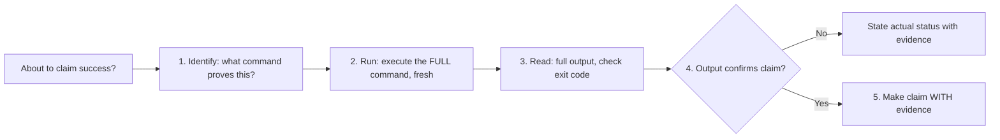

# Verification Before Completion

## Overview

Claiming work is complete without running verification is not efficiency — it is dishonesty.

**Core principle:** Evidence before claims, always.

The rule applies to the spirit, not just the letter. Any phrasing that implies success without verification evidence violates it.

## The Iron Law

```
NO COMPLETION CLAIMS WITHOUT FRESH VERIFICATION EVIDENCE
```

If you haven't run the verification command in this message, you cannot claim it passes.

## The Gate Function



**Step-by-step:**

1. **IDENTIFY**: What exact command proves this claim? (see table below)
2. **RUN**: Execute the full command fresh — not a cached result, not a partial run
3. **READ**: Read the complete output and check the exit code
4. **VERIFY**: Does the output confirm the claim?
   - If NO → State actual status with evidence
   - If YES → State claim WITH that evidence
5. **ONLY THEN**: Make the claim

Skip any step = asserting without evidence.

## What to Run for Each Claim

| Claim | Required command output | Not sufficient |
|-------|------------------------|----------------|
| Tests pass | Test runner: 0 failures | Previous run, "should pass" |
| Linter clean | Linter: 0 errors/warnings | Partial check, extrapolation |
| Build succeeds | Build command: exit 0 | Linter passing, logs "look OK" |
| Bug fixed | Original symptom: test passes | Code changed, assumed fixed |
| Regression test works | Full red→green cycle verified | Test passes once |
| Agent task completed | VCS diff shows expected changes | Agent reports "success" |
| Requirements met | Line-by-line checklist verified | Tests passing |
| Types valid | Type checker: 0 errors | Code compiles |
| No regressions | Full test suite: 0 new failures | Feature tests pass |

## Finding the Right Verification Command

Not sure what command to run? Start here:

```bash
# Common test runners
npm test                    # Node.js (Jest, Vitest, Mocha)
python -m pytest            # Python
cargo test                  # Rust
go test ./...               # Go
bundle exec rspec           # Ruby

# Common linters/type checkers
npm run lint                # JS/TS (ESLint)
npx tsc --noEmit            # TypeScript types
mypy .                      # Python types
cargo clippy                # Rust
golangci-lint run           # Go

# Common build commands
npm run build               # JS/TS
cargo build                 # Rust
go build ./...              # Go

# Check package.json/Makefile for project-specific commands
grep -A20 '"scripts"' package.json
grep "^[a-z]" Makefile
```

When uncertain, check the project README, `Makefile`, or `package.json` `scripts` section.

## Before a Commit or PR

Run all of these, in order, before committing or opening a PR:

```
1. [ ] Tests pass (full suite, not just changed files)
2. [ ] No lint errors
3. [ ] No type errors
4. [ ] Build succeeds
5. [ ] Original bug/requirement is demonstrably addressed
6. [ ] No unintended side effects in related tests
```

Every box must be checked with actual command output, not assumption.

## Key Patterns

**Tests:**

<Good>
```bash
$ npm test
PASS: 34 tests, 0 failures

# Now you can say: "All 34 tests pass"
```
</Good>

<Bad>
```
"Should pass now" / "Looks correct" / "I'm confident it works"
```
</Bad>

---

**TDD Regression Test (Red-Green Verification):**

<Good>
```bash
# 1. Write test, confirm it passes with fix in place
$ npm test feature.test.ts
PASS

# 2. Temporarily revert the fix
# 3. Confirm test now FAILS (proves test catches the bug)
$ npm test feature.test.ts
FAIL: expected X, got Y

# 4. Restore fix, confirm passes again
$ npm test feature.test.ts
PASS
```
</Good>

<Bad>
```
"I've written a regression test" (without verifying the red state)
```
</Bad>

---

**Requirements checklist:**

<Good>
```
1. Re-read the plan/requirements document
2. For each requirement item:
   - Write down how you'll verify it
   - Run that verification
   - Check it off, or flag it as a gap
3. Report: "X of Y requirements verified, Z gaps found"
```
</Good>

<Bad>
```
"Tests pass, so the phase is complete"
```
</Bad>

---

**Agent delegation:**

<Good>
```bash
# Agent reports "done"
$ git diff HEAD~1   # What actually changed?
$ npm test          # Does it still pass?
```
</Good>

<Bad>
```
Trust the agent's success report without independent verification
```
</Bad>

## When Verification Is Slow

If the full test suite takes a long time:

1. **Run the specific test file first** — fast feedback loop, catches most issues
2. **Run the full suite before commit** — required, not optional
3. **Never skip the full suite before a PR** — no exceptions

Partial verification is acceptable for iteration. It is never acceptable as the final gate before claiming completion.

## Red Flags — Stop

Encountering any of these means you haven't verified yet:

- Using "should", "probably", "seems to", "looks like"
- Expressing satisfaction before verification ("Great!", "Perfect!", "Done!")
- About to commit/push/PR without having run all checks
- Trusting agent success reports without independent verification
- Using a previous run's output as proof
- **ANY wording that implies success without evidence from this session**

## Rationalization Prevention

| Excuse | Reality |
|--------|---------|
| "Should work now" | Run the verification |
| "I'm confident" | Confidence ≠ evidence |
| "Just this once" | No exceptions |
| "Linter passed" | Linter ≠ compiler ≠ tests |
| "Agent said success" | Verify independently |
| "Partial check is enough" | Partial proves nothing for final gate |
| "Different words, rule doesn't apply" | Spirit over letter |
| "I already checked mentally" | Mental simulation ≠ execution |
| "The CI will catch it" | Your job is to catch it before CI |

## Why This Matters

Every shortcut here has a known failure mode:

- Undefined functions ship → crashes in production
- Missing requirements ship → incomplete features reach users  
- False completion claims break trust between collaborators
- Time wasted on redirects and rework after false "done" reports

The verification step costs seconds. The rework from skipping it costs hours.

## The Bottom Line

Run the command. Read the output. THEN claim the result.

This is non-negotiable.
